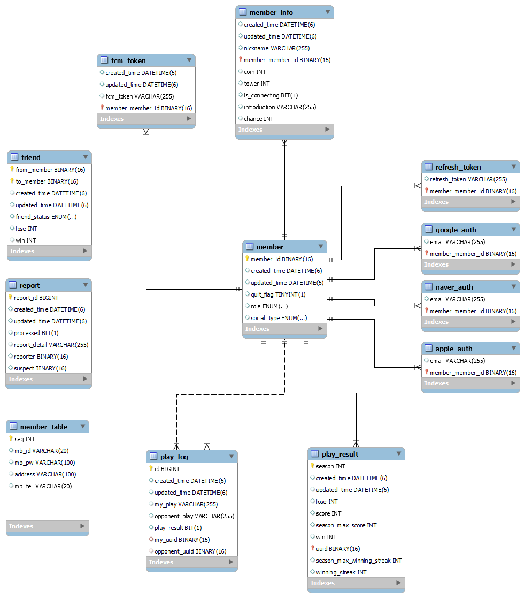
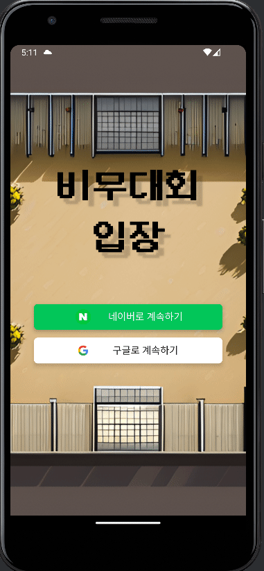
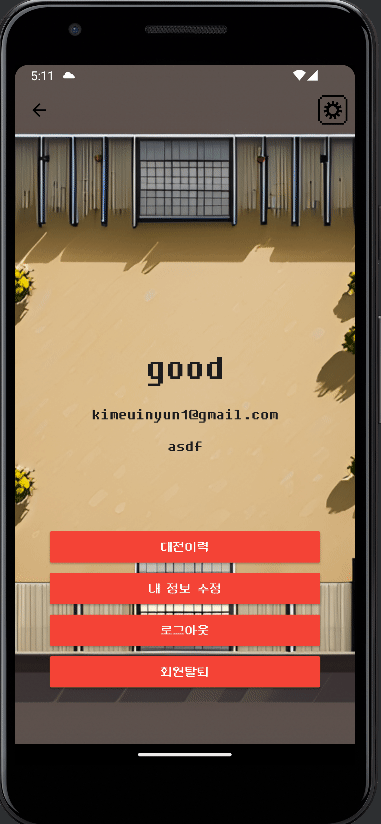
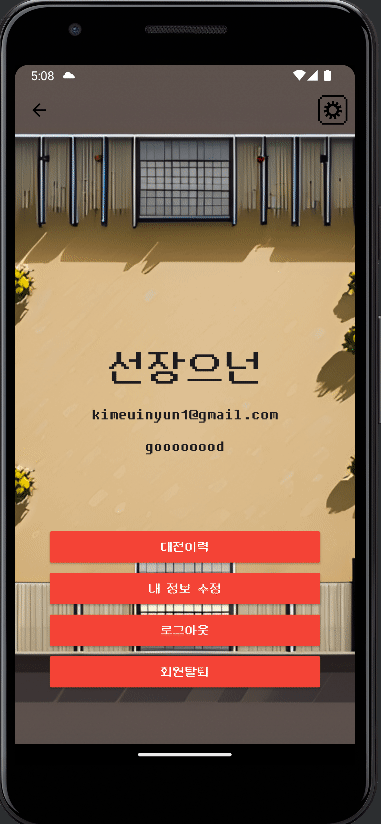
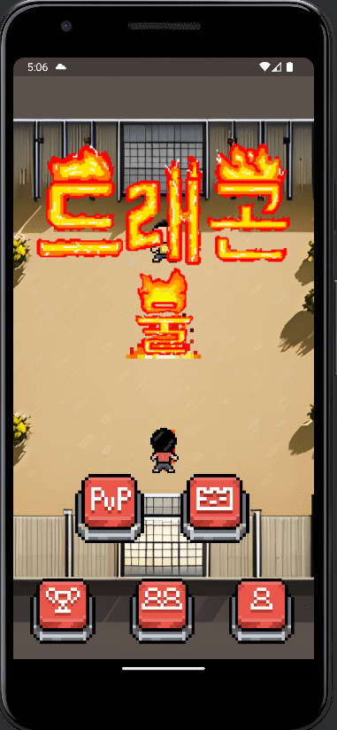
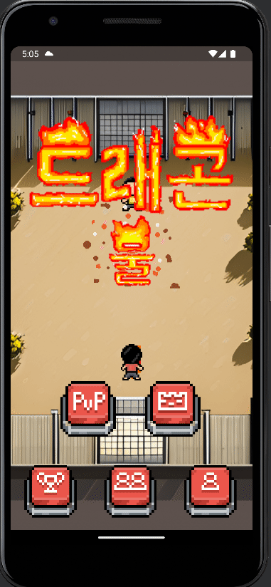

# 드래곤 불 - 천하제일 쎄쎄쎄
#### 구글 플레이 스토어 주소
https://play.google.com/store/apps/details?id=com.capsule.frontend
#### 드래곤 불 홍보 영상 주소
https://www.youtube.com/watch?v=QjlcItBnrfY

## 목차
- [배경](#배경)
- [개요](#개요)
- [기술 스택](#기술-스택)
- [프로젝트 구조](#프로젝트-구조)
- [아키텍쳐](#아키텍쳐)
- [팀원 소개](#팀원-소개)
- [ERD](#erd)
- [주요 기능](#주요-기능)
- [릴리즈 노트](#릴리즈-노트)
- [시연](#시연)

    
---
### 배경
```
요즘에는 옛날에 유행했던 것들을 많이 찾습니다. 그렇게 찾은 옛날 것을 현대적으로 재해석한 것을 "뉴트로" 라고 합니다.

옛날의 것을 많이 가져와서 재해석했지만, 아직 안 된 것들도 많습니다. 특히, 어릴 때 많이 하던 쎄쎄쎄 같은 경우 비슷하게 재해석한 것도 없습니다.

특히, 드래곤 볼 쎄쎄쎄는 2019년에 대회가 열렸던 만큼 여전히 인기가 있습니다.
그래서 저희는 이러한 드래곤 볼 쎄쎄쎄를 재해석한 서비스, 드래곤 불 : 천하제일 쎄쎄쎄를 만들려고 합니다. 
```

### 개요
```
드래곤 볼 쎄쎄쎄를 재해석한 드래곤 불 : 천하제일 쎄쎄쎄
```

### 기술 스택

#### FRONTEND
```
Flutter
Dart
```

#### BACKEND
```
Java 17
Spring boot 3.1
Mysql 8.0.34
Redis 7.2.2
Spring Security
JPA
Stomp
Gradle
```

#### INFRA
```
Nginx
Prometheus
Grafana
AWS EC2
Docker
```

#### Configuration Management
```
git
```

#### Issue Management
```
JIRA
```

#### Communication
```
Mattermost
Notion
```

#### Design Tool
```
Photoshop
Pixel Studio
```

### 프로젝트 구조
#### FRONTEND
```
lib
 ┣ assets
 ┃ ┣ fonts
 ┃ ┣ icons
 ┃ ┗ skills
 ┣ models
 ┃ ┣ friend_models
 ┃ ┗ ranking_models
 ┣ screens
 ┣ services
 ┣ utils
 ┣ widgets
 ┃  ┗ friend_widgets
 ┗ main.dart
```

#### BACKEND
```
java
 ┗ com
 ┃ ┗ dragong
 ┃ ┃ ┗ dragong
 ┃ ┃ ┃ ┣ domain
 ┃ ┃ ┃ ┃ ┣ friend
 ┃ ┃ ┃ ┃ ┃ ┣ controller
 ┃ ┃ ┃ ┃ ┃ ┣ dto
 ┃ ┃ ┃ ┃ ┃ ┃ ┣ request
 ┃ ┃ ┃ ┃ ┃ ┃ ┗ response
 ┃ ┃ ┃ ┃ ┃ ┣ entity
 ┃ ┃ ┃ ┃ ┃ ┣ repository
 ┃ ┃ ┃ ┃ ┃ ┗ service
 ┃ ┃ ┃ ┃ ┣ game
 ┃ ┃ ┃ ┃ ┃ ┣ controller
 ┃ ┃ ┃ ┃ ┃ ┣ dto
 ┃ ┃ ┃ ┃ ┃ ┃ ┣ request
 ┃ ┃ ┃ ┃ ┃ ┃ ┣ response
 ┃ ┃ ┃ ┃ ┃ ┣ Handler
 ┃ ┃ ┃ ┃ ┃ ┣ repository
 ┃ ┃ ┃ ┃ ┃ ┗ service
 ┃ ┃ ┃ ┃ ┃   ┣ serviceImpl
 ┃ ┃ ┃ ┃ ┣ member
 ┃ ┃ ┃ ┃ ┃ ┣ controller
 ┃ ┃ ┃ ┃ ┃ ┣ dto
 ┃ ┃ ┃ ┃ ┃ ┃ ┣ request
 ┃ ┃ ┃ ┃ ┃ ┃ ┗ response
 ┃ ┃ ┃ ┃ ┃ ┣ entity
 ┃ ┃ ┃ ┃ ┃ ┃ ┣ auth
 ┃ ┃ ┃ ┃ ┃ ┣ repository
 ┃ ┃ ┃ ┃ ┃ ┗ service
 ┃ ┃ ┃ ┃ ┣ playLog
 ┃ ┃ ┃ ┃ ┃ ┣ controller
 ┃ ┃ ┃ ┃ ┃ ┣ dto
 ┃ ┃ ┃ ┃ ┃ ┣ entity
 ┃ ┃ ┃ ┃ ┃ ┣ repository
 ┃ ┃ ┃ ┃ ┃ ┗ service
 ┃ ┃ ┃ ┃ ┃   ┣ serviceImpl
 ┃ ┃ ┃ ┃ ┣ playResult
 ┃ ┃ ┃ ┃ ┃ ┣ Controller
 ┃ ┃ ┃ ┃ ┃ ┣ dto
 ┃ ┃ ┃ ┃ ┃ ┣ entity
 ┃ ┃ ┃ ┃ ┃ ┣ repository
 ┃ ┃ ┃ ┃ ┃ ┗ service
 ┃ ┃ ┃ ┃ ┃   ┣ serviceImpl
 ┃ ┃ ┃ ┃ ┗ report
 ┃ ┃ ┃ ┃   ┣ controller
 ┃ ┃ ┃ ┃   ┣ dto
 ┃ ┃ ┃ ┃   ┣ entity
 ┃ ┃ ┃ ┃   ┣ repository
 ┃ ┃ ┃ ┃   ┗ service
 ┗ ┻ ┻ ┻  global
           ┣ auth
           ┣ common
           ┣ config
           ┗ util
```


### 팀원 소개


### ERD


### 주요 기능
#### 1. PvP
- 모르는 사람들과 매칭되어 게임 진행
- 게임 결과에 따라서 점수 변동 랭킹 반영
- 게임이 오랫동안 매칭이 안될시 봇과 매칭
#### 2. 랭킹
- 실시간 랭킹
- 일주일에 한번씩 시즌이 초기화 되어 랭킹 초기화
- 시즌이 초기화될시 랭킹에 따라서 보상 차등 지급
#### 3. 친구
- 원하는 사람과 친구를 맺기
- 친구끼리는 언제든지 대전 가능 및 해당 친구와의 전적 기록
- 현재 접속중인 친구를 실시간으로 확인가능
#### 4. PvE
- 일반 PvP와 조금 다른 룰로 진행되는 타워
  - `기`를 모은 수 만큼 `파`가 강해짐
  - 각 층의 보스는 서로 다른 회피율과 체력을 보유 중
- 총 100층으로, 각각의 층 클리어시 보상 지급

### 릴리즈 노트
#### 0.0.x
##### 로그인
- 구글 혹은 네이버 ID를 통해서 로그인이 가능합니다.
- 중복되지 않은 닉네임으로 닉네임을 변경할 수 있습니다.

##### 게임
- 매칭을 통해서 게임 진행이 가능합니다.
- 게임에서 승리시 점수를 획득하고, 패배시 점수를 잃습니다.
- 점수를 통해서 랭킹이 매겨집니다.

##### 친구
- 유저를 검색 후 친구 추가가 가능합니다.

##### 신고
- 불법 프로그램, 비매너 유저를 신고할 수 있습니다.

#### 1.0.0
##### 공통
- 배경 음악이 추가되었습니다.
- 배경 이미지가 추가되었습니다.

##### UI 개편
- 기, 막기, 파, 순간이동, 원기옥 의 UI가 더 직관적이게 바뀌었습니다.
- 버튼들의 배치 및 UI가 변경되었습니다.

##### 게임 개편
- 게임 진행이 3판 2선으로 바뀌었습니다.
- 게임이 3판 2선으로 되었기 때문에 체력이 추가되었습니다.
- 오랫동안 전투 후 이길 경우 점수를 더 많이 주게 변경되었습니다.
- 오랫동안 전투 후 질 경우 점수를 덜 잃게 변경되었습니다.
- 자신이 현재 기를 몇개 모았는지 알려줍니다.
- 자신이 이번 차례에서 어느 버튼을 눌렀는지 더 자세히 알려줍니다.
- 상대방에게 공격이 성공할 때 진동으로 알려줍니다.
- 자신이 현재 버튼을 눌렀는지 진동으로 알려줍니다.
- 매칭이 오랜시간 동안 안될시 봇과 게임을 진행합니다.
- 매칭이 될시에 상대방의 포부를 확인할 수 있습니다.
- 매칭이 될시에 상대방의 전적과 현재 연승 정보를 알 수 있습니다.
- 최근 5경기의 전적을 확인할 수 있습니다.
- 기, 막기, 파, 순간이동, 원기옥 의 모션이 좀 더 매끄럽게 변경되었습니다.

##### 친구 개편
- 친구 신청을 하면 알람이 가게 변경되었습니다.
- 현재 접속 중인 친구 목록을 확인할 수 있습니다.
- 친구와 대전을 진행할 수 있습니다.
- 친구와의 대전 전적을 기록하고 확인할 수 있습니다.
- 친구 대전은 점수에 반영되지 않습니다.

##### PvE 기능 추가
- 총 100층의 층을 오를 수 있습니다.
- 각각의 층에는 서로 다른 보스가 있으며, 각각의 보스는 회피율과 체력을 가지고 있습니다.
- 유저는 기를 모은 만큼 강한 파를 쏠 수 있습니다.
    - 최대 2만큼 체력을 깎습니다.
- 원기옥은 4만큼 체력을 깎습니다.

##### 편의성 개편
- 게임의 BGM, 진동을 켜고 끌 수 있습니다.
- 튜토리얼이 추가되었습니다.
- 최근 다섯 경기의 게임 로그를 확인할 수 있습니다.


### 시연
#### 게임 접속


#### 로그인 및 메인화면


- 구글과 네이버 아이디를 통해서 로그인 할 수 있습니다. 

#### 로그아웃


#### 마이페이지


#### 대전 이력 조회


- 본인의 최근 5경기 이력을 확인할 수 있습니다.
- 또한 이력을 클리하면 상세보기가 가능합니다. 

#### 닉네임 변경


- 최대 6자로 닉네임을 변경할 수 있습니다. 

#### 자기 소개 변경


- 매칭시 보이는 자기 소개 문구를 바꿀 수 있습니다. 

#### 친구 목록 조회


- 나와 친구의 사람의 목록을 보여줍니다.
- 친구 목록에서 빨간 점이 있는 사람이 있는데, 이는 현재 접속 중인 사람입니다. 

#### 친구 추가


- 받은 요청에 대해서 수락을 눌러 친구를 할 수 있습니다. 

#### 친구 삭제


- 친구 대전 추가

#### 랭킹


- 1분에 한번씩 초기화 되는 랭킹을 볼 수 있습니다. 
- 점수가 같은 사람은 같은 랭킹을 받고, 그 만큼 랭킹은 뒤로 밀립니다. 
- 예시) 점수가 100, 100, 50 있으면 랭킹은 1, 1, 3 입니다. 
- 랭킹 오른쪽에 불꽃의 색이 랭크 입니다. 
- 랭크는 점수에 따라서 지급이 됩니다. 

#### 게임 매칭


#### 매칭 성공


  - 매칭 상대와 플레이어의 프로필이 함께 표시됩니다.
  - 프로필에는 점수, 전적, 연승 수 그리고 자기소개가 들어갑니다.

#### 게임 결과


#### 타워

